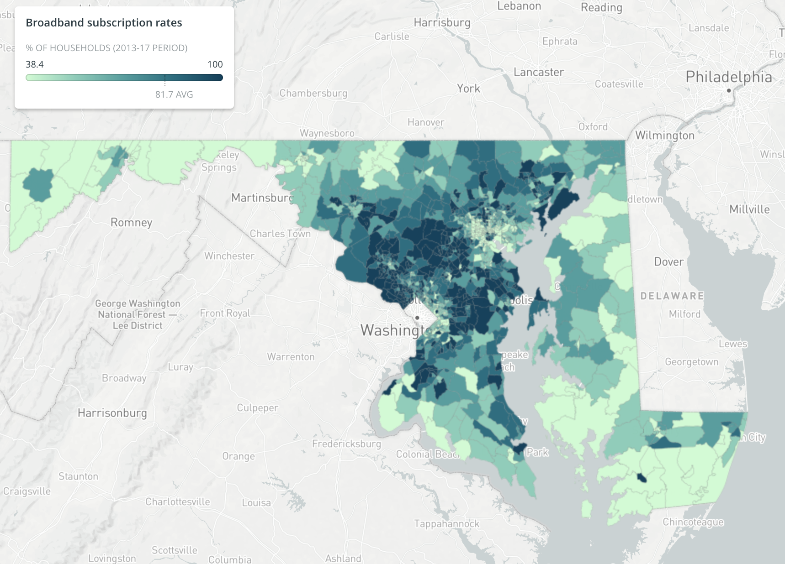

# Census data analysis: ACS and SAIPE

By [Christine Zhang](mailto:czhang@baltsun.com)

An analysis of data from the 2013-17 American Community Survey (ACS) and the Small Area Income Poverty Estimates (SAIPE) program for a December 7, 2018 Baltimore Sun story titled ["What new Census data reveal about wealth, diversity, and connectivity in Maryland"](https://www.baltimoresun.com/news/maryland/bs-md-acs-census-release-20181206-story.html).

The code used to produce the analysis is saved in a series of six notebooks.

Each notebook corresponds to a topic in the story. For example, [`04_broadband_acs.ipynb`](http://nbviewer.jupyter.org/github/baltimore-sun-data/census-data-analysis-2018/blob/master/04_broadband_acs.ipynb) refers to the findings in the story under the section in the [story](https://www.baltimoresun.com/news/maryland/bs-md-acs-census-release-20181206-story.html) referring to broadband connectivity, "Maryland rates well nationally for broadband connectivity, but Baltimore and the state's western- and southern-most counties lag."

We used [`tidycensus`](https://walkerke.github.io/tidycensus/index.html) by Kyle Walker and [`censusapi`](https://hrecht.github.io/censusapi/index.html) by Hannah Recht to access the Census Bureau API in `R`.

https://twitter.com/baltsundata

## Community Contributions

There are many angles to explore with this data.

**Have something to contribute?** Send us a [pull request](https://baltimore-sun-data/census-data-analysis-2018/pulls) or contact us on Twitter [@baltsundata](https://twitter.com/baltsundata) or via [email](mailto:czhang@baltsun.com)

You can also fork a copy of this repo to your own account.

## Licensing

All code in this repository is available under the [MIT License](https://opensource.org/licenses/MIT). The data files are available under the [Creative Commons Attribution 4.0 International](https://creativecommons.org/licenses/by/4.0/) (CC BY 4.0) license.